# Task Insight Document Management System
## User Manual

**Version:** 1.0  
**Last Updated:** December 2025

---

## Table of Contents

1. [Introduction](#1-introduction)
2. [Getting Started](#2-getting-started)
3. [User Roles](#3-user-roles)
4. [Login and Authentication](#4-login-and-authentication)
5. [Dashboard Overview](#5-dashboard-overview)
6. [File Management](#6-file-management)
7. [Folder Management](#7-folder-management)
8. [File Reminders & To-Do Documents](#8-file-reminders--to-do-documents)
9. [Storage Quota](#9-storage-quota)
10. [Organization Admin Panel](#10-organization-admin-panel)
11. [Platform Admin Panel](#11-platform-admin-panel)
12. [Troubleshooting](#12-troubleshooting)
13. [Support](#13-support)

---

## 1. Introduction

Task Insight Document Management System (DMS) is a secure, web-based platform designed to help organizations manage, store, and share documents efficiently. The system provides:

- **Centralized Storage**: All your documents in one secure location
- **Role-Based Access Control**: Different permission levels for different users
- **Audit Trail**: Complete tracking of all document activities
- **Organization Management**: Multi-tenant support for multiple organizations

---

## 2. Getting Started

### 2.1 System Requirements

To use Task Insight DMS, you need:

- A modern web browser (Chrome, Firefox, Safari, or Edge)
- Stable internet connection
- Valid user credentials (email and password)

### 2.2 Accessing the System

Open your web browser and navigate to your organization's Task Insight URL. You will be presented with the login page.

---

## 3. User Roles

Task Insight DMS has three user roles:

| Role | Description | Permissions |
|------|-------------|-------------|
| **Platform Owner** | System administrator with full access | Manage all organizations, users, and system settings |
| **Organization Admin** | Organization-level administrator | Manage users within their organization, view audit logs, monitor storage |
| **Member** | Regular user | Upload, view, and manage their own files and shared content |

---

## 4. Login and Authentication

### 4.1 Login Page

When you access the system, you will see the login page:

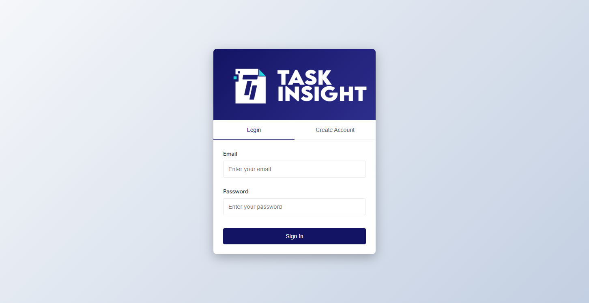

The login page features:
- **Login** and **Create Account** tabs
- Email and Password fields
- Sign In button

### 4.2 Logging In

**Step 1:** Enter your email address and password

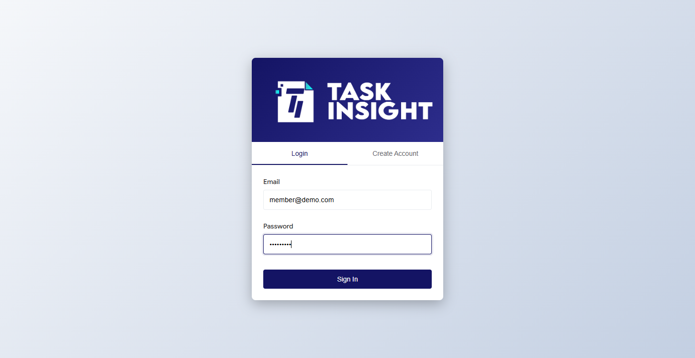

**Step 2:** Click the **Sign In** button

If your credentials are correct, you will be redirected to your dashboard.

### 4.3 Creating an Account

Click on **Create Account** tab to see registration options:

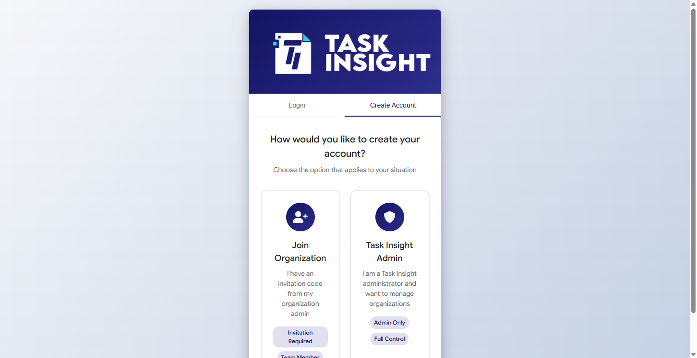

You have two options:

**Option 1: Join Organization**
- For users who have received an invitation code
- Enter your invitation code and personal details
- Click "Join Organization"

**Option 2: Task Insight Admin**
- For platform administrators only
- Requires admin credentials

### 4.4 Logging Out

To log out:

1. Click on your profile icon in the top-right corner
2. Select **Logout** from the dropdown menu

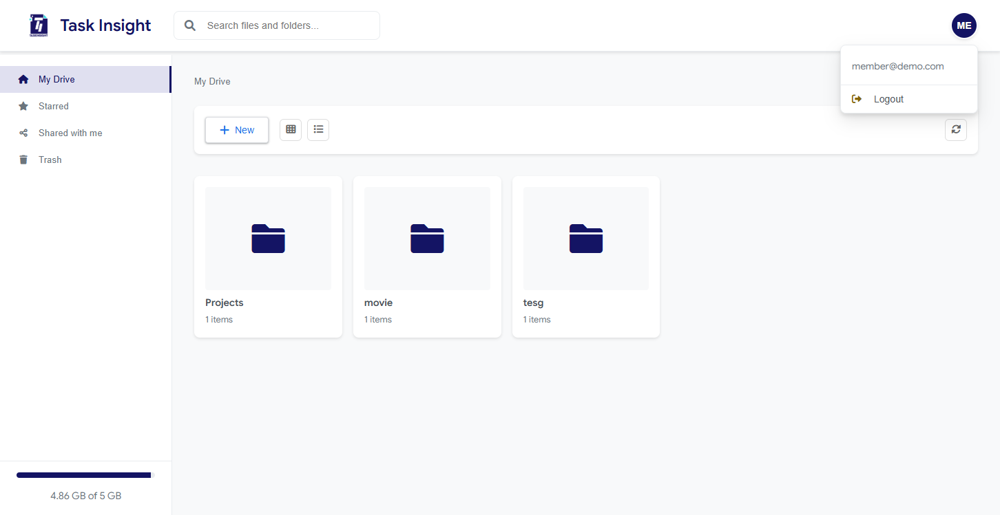

---

## 5. Dashboard Overview

After logging in, you will see your main dashboard (My Drive):

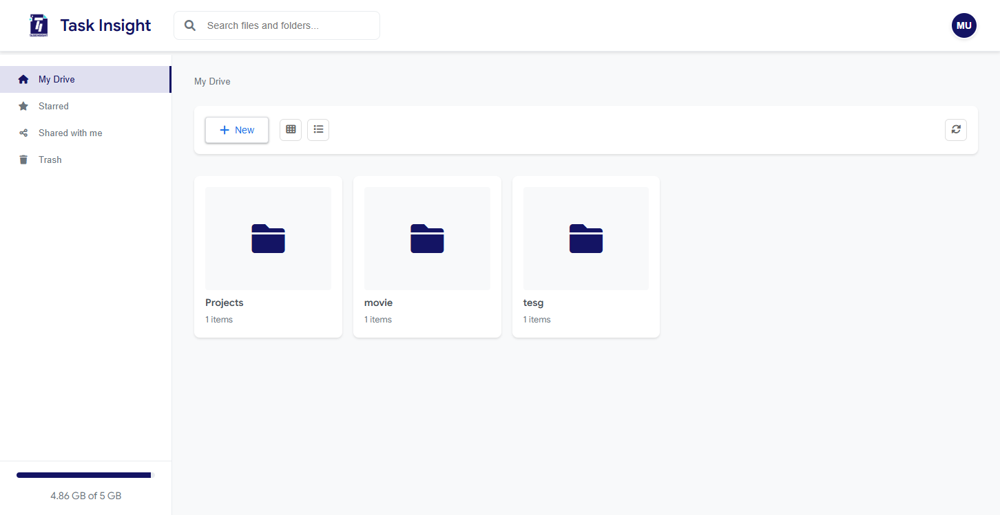

### 5.1 Dashboard Components

**Header Bar:**
- Task Insight logo (click to go home)
- Search bar for finding files and folders
- Notification bell (shows pending reminders with badge)
- User profile icon (shows your initials)

**Sidebar Navigation:**
- **My Drive**: Your personal file storage
- **Starred**: Files you've marked as important
- **Shared with me**: Files others have shared with you
- **To-Do Documents**: Files with reminders and due dates
- **Trash**: Deleted files (recoverable for 30 days)

**Storage Indicator:**
- Shows your storage usage (e.g., "4.86 GB of 5 GB")
- Color-coded: Green (safe), Yellow (warning), Red (near limit)

**Main Content Area:**
- Displays your folders and files
- Grid or list view options
- Toolbar with New, View toggle, and Refresh buttons

### 5.2 Empty State

When your drive is empty, you'll see:

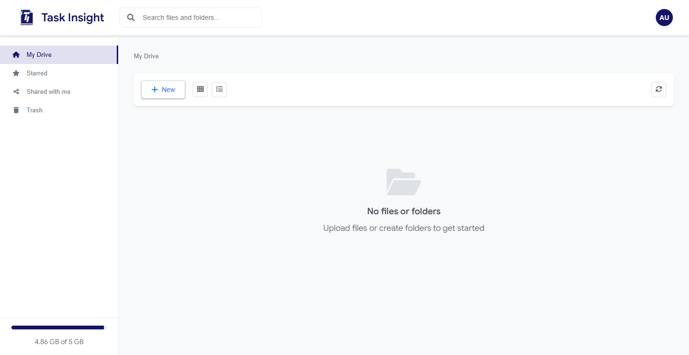

The message "No files or folders" with a prompt to upload or create content.

---

## 6. File Management

### 6.1 Creating New Content

Click the **+ New** button to see options:

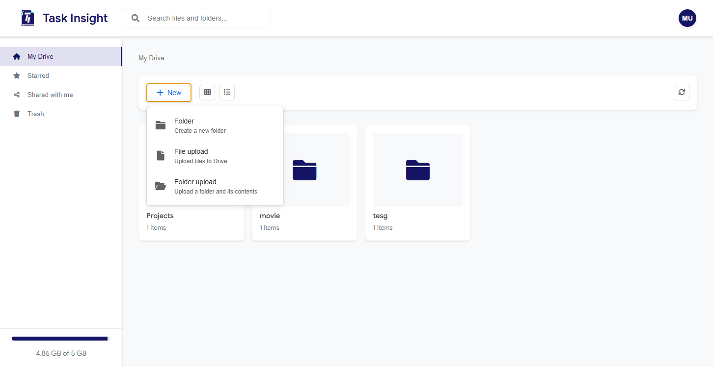

Options include:
- **Folder**: Create a new folder
- **File upload**: Upload files from your computer
- **Folder upload**: Upload an entire folder with contents

### 6.2 Creating a Folder

**Step 1:** Click **+ New** → **Folder**

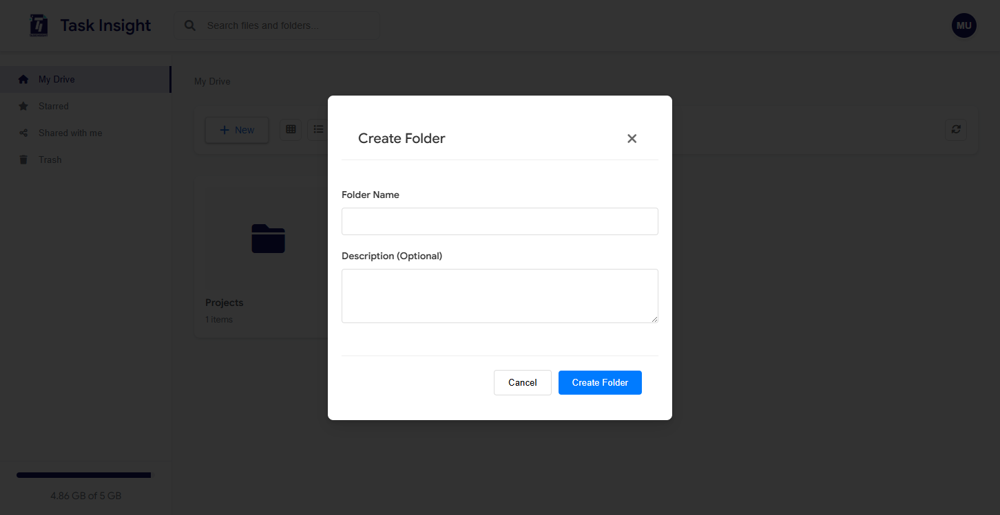

**Step 2:** Enter a folder name and optional description

**Step 3:** Click **Create Folder**

The new folder will appear in your current location.

### 6.3 Uploading Files

**Method 1: Using the Menu**
1. Click **+ New** → **File upload**
2. Select files from your computer
3. Wait for upload to complete

**Method 2: Drag and Drop**
1. Drag files from your computer
2. Drop them onto the dashboard area
3. Files upload automatically

### 6.4 File Actions

Each file has action buttons:
- **Star**: Mark as important (appears in Starred section)
- **More options**: Additional actions like download, delete, share

### 6.5 File Context Menu

Right-click on any file to access additional options:

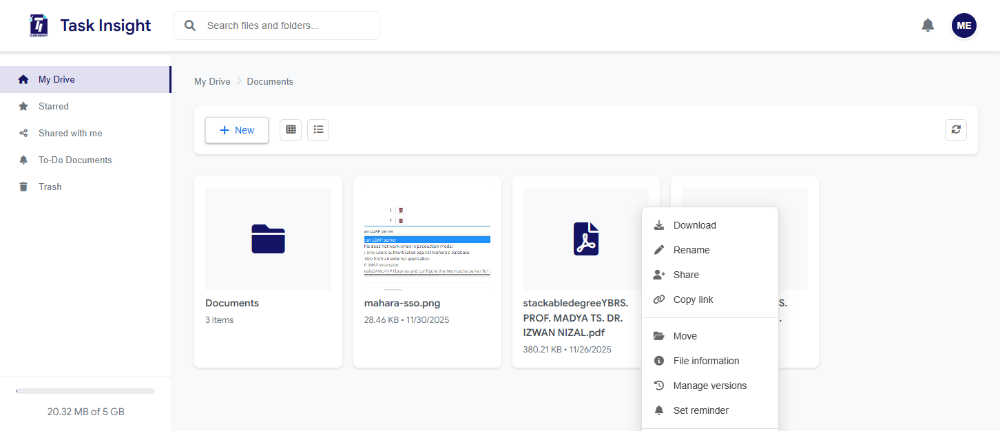

Available actions:
- **Download**: Download the file to your computer
- **Rename**: Change the file name
- **Share**: Share with other users
- **Copy link**: Get a shareable link
- **Move**: Move to another folder
- **File information**: View file details and metadata
- **Manage versions**: View and restore previous versions
- **Set reminder**: Create a reminder for this file (NEW!)
- **Move to trash**: Delete the file

---

## 7. Folder Management

### 7.1 Navigating Folders

- **Double-click** a folder to open it
- Use the **breadcrumb** at the top to navigate back
- The current path shows as: My Drive > Folder Name > Subfolder

### 7.2 Folder View

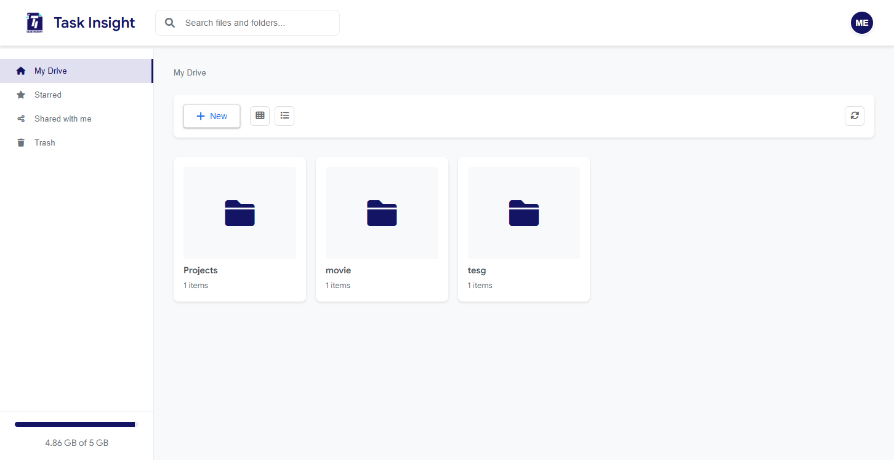

Each folder shows:
- Folder icon
- Folder name
- Number of items inside

---

## 8. File Reminders & To-Do Documents

Task Insight DMS includes a powerful reminder system to help you stay on top of important documents and deadlines.

### 8.1 Setting a Reminder

**Method 1: Using Context Menu**

**Step 1:** Right-click on any file

**Step 2:** Select **Set reminder** from the menu

**Method 2: From File Actions**

Click the "More options" button (⋮) on a file and select "Set reminder"

### 8.2 Reminder Modal

When you set a reminder, a modal will appear:

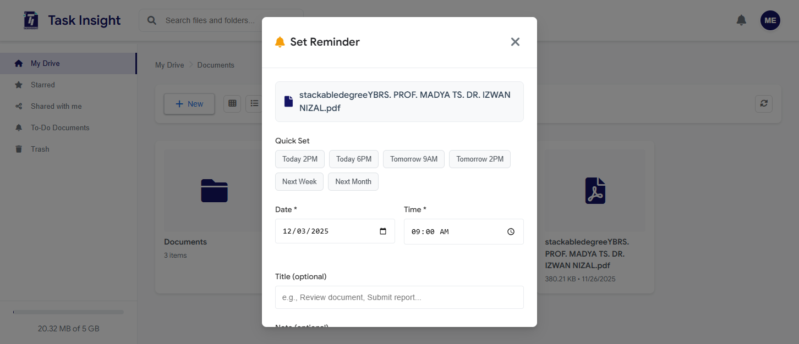

**Quick Preset Buttons:**
- **Today 2PM**: Set reminder for today at 2:00 PM
- **Today 6PM**: Set reminder for today at 6:00 PM
- **Tomorrow 9AM**: Set reminder for tomorrow at 9:00 AM
- **Tomorrow 2PM**: Set reminder for tomorrow at 2:00 PM
- **Next Week**: Set reminder for 7 days from now
- **Next Month**: Set reminder for 30 days from now

**Custom Settings:**

1. **Date & Time**: Choose specific date and time
   - Use the date picker for the date
   - Use the time picker for the time

2. **Title** (Optional): Give your reminder a descriptive title
   - Example: "Review contract", "Submit report"

3. **Note** (Optional): Add additional details
   - Example: "Need to get approval from manager first"

4. **Priority**: Choose reminder importance
   - **Low** (Green flag): Nice to have
   - **Medium** (Yellow flag): Important
   - **High** (Red flag): Urgent

5. **Repeat this reminder** (Optional):
   - Check the box to make it recurring
   - Choose frequency: Daily, Weekly, Monthly, or Yearly
   - Set an end date (optional)

**Step 3:** Click **Set Reminder** to save

### 8.3 Notification Bell

The notification bell in the header shows pending reminders:

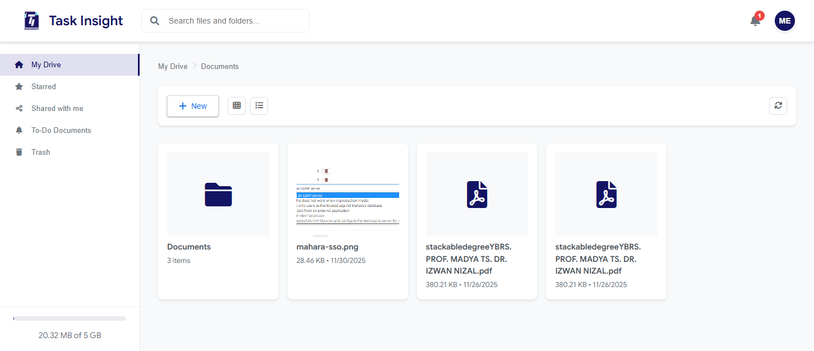

**Features:**
- **Red badge**: Shows number of pending reminders
- **Click to open**: View reminder dropdown
- **Overdue items**: Highlighted in red background
- **Quick access**: Click any reminder to go to To-Do Documents

**Notification Dropdown:**

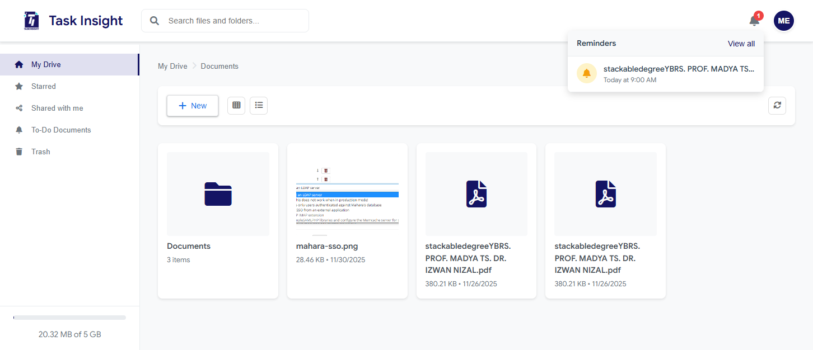

Shows:
- File name or reminder title
- Due date/time with status (overdue, today, upcoming)
- Click "View all" to see complete list

### 8.4 To-Do Documents View

Access your reminders from the sidebar:

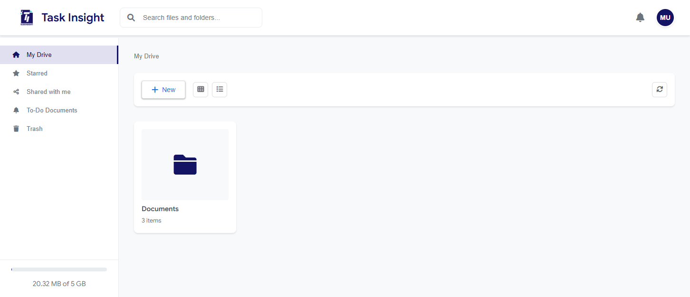

**Step 1:** Click **To-Do Documents** in the sidebar

**Step 2:** View your reminder dashboard

**Summary Cards:**

The top of the page shows four summary cards:
- **Overdue** (Red): Reminders past their due date
- **Due Today** (Yellow): Reminders due today
- **Upcoming** (Green): Reminders due within 7 days
- **All**: Total number of active reminders

Click any card to filter the list below.

**To-Do Table:**

The table displays all your reminders with:

| Column | Description |
|--------|-------------|
| **Document** | File name with folder location |
| **Due Date** | When the reminder is due (color-coded) |
| **Priority** | Low/Medium/High with flag icon |
| **Note** | Your reminder title or note |
| **Actions** | Complete, Edit, or Dismiss buttons |

**Row Colors:**
- **Red background**: Overdue reminders
- **White background**: Upcoming reminders

### 8.5 Managing Reminders

**Completing a Reminder:**

**Step 1:** Click the **✓** (checkmark) button

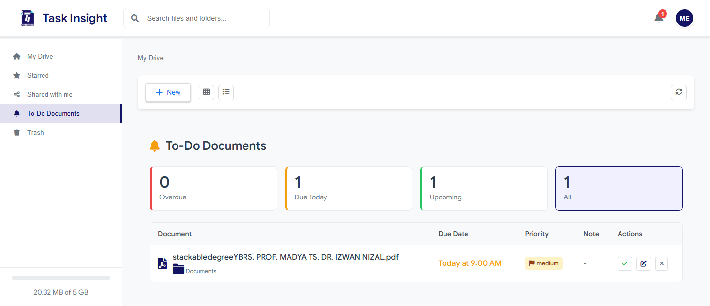

**Step 2:** The reminder is marked as complete and removed from the list

**Note:** If the reminder is recurring, a new reminder will be automatically created for the next occurrence.

**Editing a Reminder:**

**Step 1:** Click the **✎** (edit) button

**Step 2:** The reminder modal opens with current settings

**Step 3:** Make your changes and click **Update Reminder**

**Dismissing a Reminder:**

**Step 1:** Click the **✕** (dismiss) button

**Step 2:** The reminder is dismissed and removed from the list

**Note:** Dismissed reminders are permanently removed and cannot be recovered.

### 8.6 Recurring Reminders

When you complete a recurring reminder:

1. The current reminder is marked as complete
2. A new reminder is automatically created for the next occurrence
3. The new reminder appears in your To-Do Documents

**Example:**
- You set a weekly reminder for "Review weekly reports" every Monday at 9 AM
- When you complete it on Monday, a new reminder is created for next Monday
- This continues until the recurrence end date (if set)

### 8.7 Reminder Best Practices

**Tips for effective reminder usage:**

1. **Use descriptive titles**: "Review Q4 budget proposal" is better than "Review file"
2. **Set appropriate priorities**: Reserve "High" for truly urgent items
3. **Add context in notes**: Include what action needs to be taken
4. **Use recurring reminders**: For regular tasks like monthly reports
5. **Check daily**: Review your To-Do Documents each morning
6. **Complete or dismiss**: Keep your list clean by acting on reminders

**Common Use Cases:**

- **Contract reviews**: Set reminders before contract expiration dates
- **Report submissions**: Never miss a deadline
- **Document approvals**: Track pending approvals
- **Regular reviews**: Monthly/quarterly document reviews
- **Follow-ups**: Remind yourself to follow up on shared documents

---

## 9. Storage Quota

Your storage quota is displayed at the bottom of the sidebar.

**Storage Indicator Colors:**
- **Green**: Under 70% usage - plenty of space
- **Yellow**: 70-90% usage - consider cleanup
- **Red**: Over 90% usage - near limit

**When Quota is Exceeded:**
- Warning notification appears
- New uploads are blocked
- Contact your organization admin for more space

---

## 9. Organization Admin Panel

Organization admins have access to a special admin panel.

### 9.1 Accessing Admin Panel

**Step 1:** Click on your profile icon

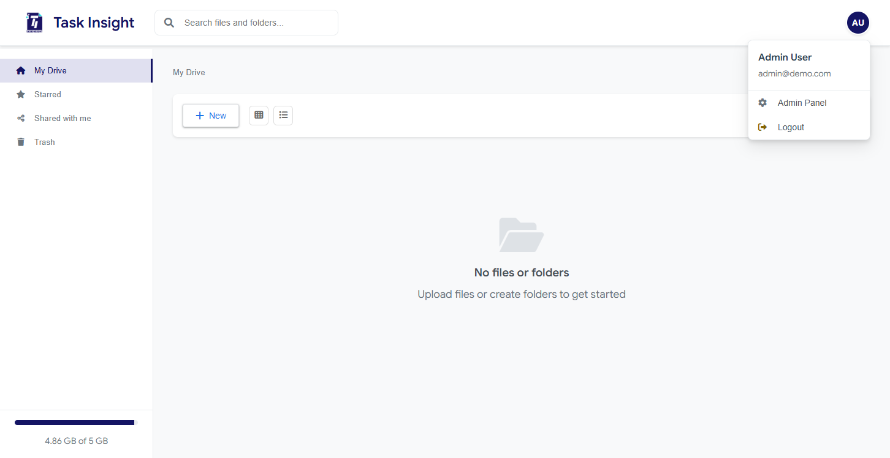

**Step 2:** Select **Admin Panel** from the dropdown

### 9.2 Overview Section

The Overview shows key organization statistics:

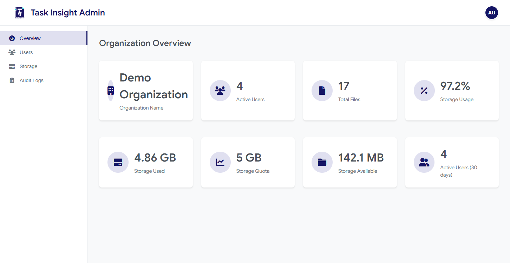

**Statistics Cards:**
- **Organization Name**: Your organization's name
- **Active Users**: Number of active users
- **Total Files**: Total files in the organization
- **Storage Usage**: Percentage of quota used
- **Storage Used**: Actual storage consumed
- **Storage Quota**: Total allocated storage
- **Storage Available**: Remaining space
- **Active Users (30 days)**: Recently active users

### 9.3 Users Section

View and manage organization users:

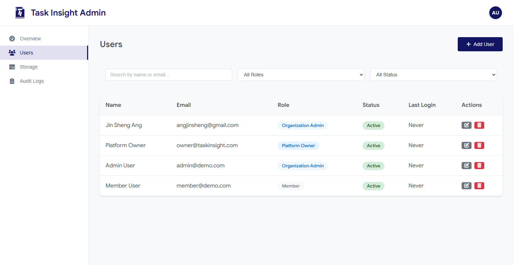

**Features:**
- Search by name or email
- Filter by role (All Roles, Platform Owner, Organization Admin, Member)
- Filter by status (All Status, Active, Inactive)

**User Table Columns:**
- **Name**: User's full name
- **Email**: User's email address
- **Role**: User's role with color-coded badge
- **Status**: Active/Inactive with badge
- **Last Login**: When the user last logged in
- **Actions**: Edit and Delete buttons

**Adding Users:**
- Click **+ Add User** button
- Fill in user details
- Assign role and send invitation

### 9.4 Storage Section

Monitor storage usage across your organization:
- Visual breakdown of storage by user
- File type distribution
- Usage trends over time

### 9.5 Audit Logs Section

Track all activities in your organization:
- **User**: Who performed the action
- **Action**: What was done (upload, download, delete, etc.)
- **Target**: Which file or folder
- **Timestamp**: When it happened
- **Details**: Additional context (JSON formatted)

---

## 10. Platform Admin Panel

Platform owners have access to the full Platform Admin Panel with:

- **All Organizations**: View and manage all organizations
- **All Users**: Manage users across all organizations
- **System Storage**: Monitor total system storage
- **Global Audit Logs**: View activity across the entire platform
- **System Settings**: Configure platform-wide settings

**Note:** Platform Admin Panel is only accessible to users with the Platform Owner role.

---

## 12. Troubleshooting

### Common Issues and Solutions

| Issue | Possible Cause | Solution |
|-------|---------------|----------|
| Cannot login | Incorrect credentials | Check email/password, use password reset |
| Upload fails | File too large or quota exceeded | Check file size limits and storage quota |
| File not visible | Wrong folder or permission | Navigate to correct folder, check sharing |
| Slow performance | Large files or network | Check internet connection, try refreshing |
| Page not loading | Browser cache | Clear cache and cookies, try incognito mode |
| Reminder not showing | Browser notifications disabled | Enable notifications in browser settings |
| Cannot set reminder | File permissions | Ensure you have access to the file |

### Error Messages

- **"Authentication failed"**: Session expired - please log in again
- **"Storage quota exceeded"**: Storage full - delete files or contact admin
- **"Upload failed"**: Check file size and format, try again
- **"Access denied"**: No permission - contact file owner or admin
- **"Failed to create reminder"**: Check date/time is in the future

### Reminder Issues

| Issue | Solution |
|-------|----------|
| Reminder not appearing in notifications | Refresh the page or check To-Do Documents |
| Cannot complete reminder | Check your internet connection and try again |
| Recurring reminder not creating | Verify end date is in the future |
| Overdue count not updating | Refresh the page (F5) |

---

## 13. Support

If you encounter issues not covered in this manual:

1. **Contact your Organization Admin** for organization-specific issues
2. **Submit a Support Ticket** through the help menu
3. **Email Support**: support@taskinsight.com

**When contacting support, please provide:**
- Your email address
- Description of the issue
- Steps to reproduce the problem
- Screenshots if applicable
- Browser and device information

---

## Quick Reference

### Keyboard Shortcuts

| Action | Shortcut |
|--------|----------|
| Search | Ctrl + F |
| New Folder | Ctrl + Shift + N |
| Upload | Ctrl + U |
| Refresh | F5 |
| View To-Do Documents | Click sidebar or notification bell |

### File Size Limits

- Maximum single file: Configured by admin
- Supported formats: All common document types

### Demo Credentials

For testing purposes:
- **Member**: member@demo.com / member123
- **Org Admin**: admin@demo.com / admin123
- **Platform Owner**: owner@taskinsight.com / admin123

---

## Document Revision History

| Version | Date | Changes |
|---------|------|---------|
| 1.0 | December 2025 | Initial release with screenshots |
| 1.1 | December 2025 | Added File Reminders & To-Do Documents feature |

---

*© 2025 Task Insight. All rights reserved.*
